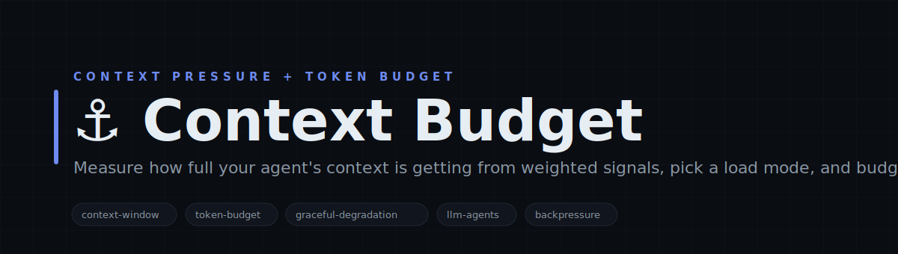
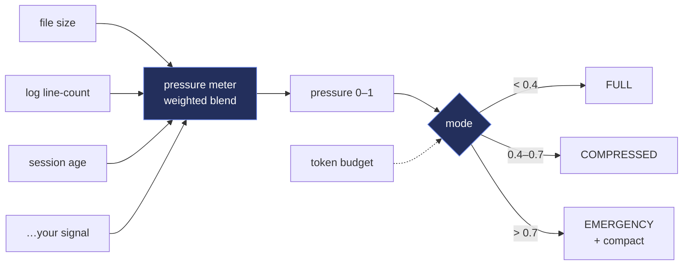
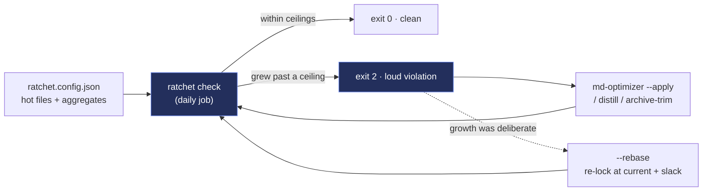
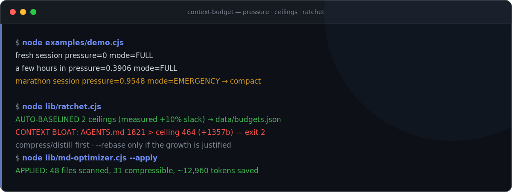

<!-- Context Budget — white-label. No personal or company identifiers in this file by design. -->

<p align="center">
  
</p>

<h1 align="center">⚓ Context Budget</h1>

<p align="center">
  <b>Measure how full your agent's context is getting, pick a load mode, budget tokens — and lock a bloat ratchet on every context-hot file so growth past its ceiling fires the day it happens.</b><br>
  <sub>Context Budget keeps a long-running LLM agent from capsizing under its own context. Register the signals that predict pressure — memory-file size, log line-counts, session age, task count, anything — each with comfortable/stressed/critical thresholds and a weight. Context Budget blends them into a single 0–1 pressure score and picks a load mode: FULL, COMPRESSED, or EMERGENCY. Pair it with a token budget (a cheap chars-based estimate or your own tokenizer) to decide how much history to keep, when to summarize, and when to hard-trim. Pure Node, zero dependencies, never throws — a small keel for agents that run for hours.</sub>
</p>

<p align="center">

= 18">

</p>

<p align="center">
<code>context-window</code> · <code>token-budget</code> · <code>graceful-degradation</code> · <code>llm-agents</code> · <code>backpressure</code> · <code>zero-deps</code>
</p>

---

## Why Context Budget

Agents that run for hours accumulate memory, logs, and history until a request silently exceeds the context window and everything degrades at once. Context Budget makes that pressure observable and actionable. You register signals — each a current value plus comfortable/stressed/critical thresholds and a weight — and Context Budget normalizes and blends them into one pressure score, then maps it to a mode: FULL loads everything, COMPRESSED loads the essentials, EMERGENCY loads the bare minimum and flags for compaction. A token budget rounds it out: estimate the cost of any text (chars/4 by default, or plug in your real tokenizer) and track spend against a ceiling. The result is graceful degradation you control, not a cliff you hit — decide what to shed while there's still room to decide.

---

## What it does

| Module | What it does | Signal |
|---|---|---|
| **pressure meter** | Blends weighted signals (size / count / age / anything) into one 0–1 score | one number to watch |
| **load modes** | Maps pressure to FULL / COMPRESSED / EMERGENCY with configurable cutoffs | graceful degradation |
| **token budget** | Estimate any text's cost and track spend against a ceiling | know the ceiling |
| **bloat ratchet** | Locks a byte ceiling on every context-hot file; growth past it exits 2 the same day; --rebase is the only way ceilings move | prevention, not cleanup |
| **md-optimizer** | Mechanical, semantics-preserving markdown compression — deterministic, idempotent, dry-run by default | free tokens back |
| **archive-trim** | Rotates append-forever .md logs: newest tail stays, older head moves to an archive — nothing deleted | bounded hot files |

---

## Architecture



The bloat ratchet runs alongside the meter — prevention where the meter is observation:



---

## Quickstart

```bash
# 1. no install needed — pure Node builtins
node examples/demo.cjs           # build a meter, print pressure + mode + budget
node examples/ratchet-demo.cjs   # baseline → bloat → violation (exit 2) → rebase, in a sandbox

# 2. the meter + budget in your code
#   const { Meter, Budget, estimateTokens } = require('./lib/context-budget.cjs');
#   const m = new Meter();
#   m.add({ name: 'memory', weight: 0.5, value: () => require('fs').statSync('mem.json').size,
#           comfortable: 50e3, stressed: 200e3, critical: 500e3 });
#   const mode = m.mode();      // 'FULL' | 'COMPRESSED' | 'EMERGENCY'
#   const b = new Budget(120000); b.spend(estimateTokens(history)); b.remaining();

# 3. the bloat ratchet — list your context-hot files in ratchet.config.json, then:
node lib/ratchet.cjs             # exit 0 clean / exit 2 the day anything crosses its ceiling
node lib/ratchet.cjs --rebase    # re-lock ceilings at current +10% (deliberate growth only)

# 4. win tokens back, mechanically + safely
node lib/md-optimizer.cjs --dir docs            # dry-run report (genuinely read-only)
node lib/md-optimizer.cjs --dir docs --apply    # apply (atomic, idempotent)
node lib/archive-trim.cjs --file notes.md --apply   # rotate an append-forever log
```

> The Meter and Budget hold no state and make no network calls — pure, fail-open functions. The ratchet is the one stateful piece: it keeps ceilings, status, and history under ./data (gitignored) and is built to run from a daily job — first run auto-baselines, so wiring it into cron is one line.

---

## See it run

<p align="center">
  
</p>

---

## Repository layout

```
context-budget/
├── lib/
│   ├── context-budget.cjs   ← the pressure Meter, load modes, and token Budget (pure)
│   ├── ratchet.cjs          ← the bloat ratchet: locked ceilings · auto-baseline · --rebase · exit 2
│   ├── md-optimizer.cjs     ← semantics-preserving .md token compression (dry-run default)
│   └── archive-trim.cjs     ← rotate append-forever .md logs to an archive, newest tail kept
├── examples/
│   ├── demo.cjs             ← register a few signals, print pressure / mode / budget
│   └── ratchet-demo.cjs     ← full ratchet lifecycle in a sandbox: 0 → 2 → 0
├── ratchet.config.json      ← (yours) the hot files + aggregates the ratchet watches
└── data/                    ← ratchet ceilings, status, history (gitignored, auto-created)
```

---

## Concepts

| Concept | Meaning |
|---|---|
| **Pressure signal** | A weighted, normalized reading (file size, log lines, session minutes, ...) that blends into one 0-1 context-pressure number. |
| **Load mode** | FULL / COMPRESSED / EMERGENCY — picked from blended pressure so long sessions degrade gracefully instead of blowing up. |
| **Hot surface** | Any file loaded into the agent's window at session start — system prompts, instruction files, skill descriptions, memory digests. |
| **Byte ceiling** | The locked maximum size for a hot surface. Growth past it is a same-day loud violation (exit 2), not a slow drift. |
| **Ratchet + rebase** | Ceilings never loosen on their own; --rebase re-locks them at current size + slack only when growth is deliberate. |
| **md-optimizer** | Mechanical, semantics-preserving markdown compression — trailing whitespace, blank-run collapse, verbose-phrase rewrites. Idempotent. |
| **Archive rotation** | Append-forever log files keep their newest tail; the older head moves to an archive file — nothing is ever deleted. |

---

## Design principles

1. **Make pressure observable.** One 0–1 score from weighted signals beats discovering the ceiling by hitting it.
2. **Degrade on purpose.** Modes let you shed load in steps while you still have room to choose what to keep.
3. **Bring your own signals + tokenizer.** Everything is injected — file sizes, counts, ages, a real token counter — nothing is hardwired to one app.
4. **Pure + fail-open.** No disk, no network, no throws — a signal that errors contributes 0, and the meter keeps reading.

---

<p align="center"><sub>Context Budget · measure · mode · budget · MIT</sub></p>
