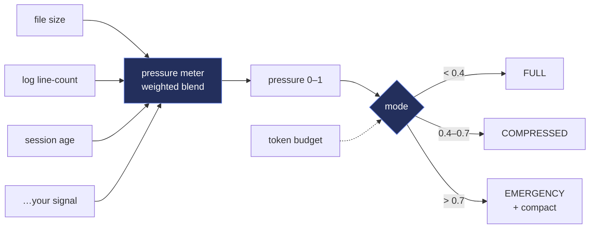

<!-- BALLAST — white-label. No personal or company identifiers in this file by design. -->

<p align="center">
  
</p>

<h1 align="center">⚓ BALLAST</h1>

<p align="center">
  <b>Measure how full your agent's context is getting from weighted signals, pick a load mode, and budget tokens — so long sessions degrade gracefully instead of blowing up.</b><br>
  <sub>BALLAST keeps a long-running LLM agent from capsizing under its own context. Register the signals that predict pressure — memory-file size, log line-counts, session age, task count, anything — each with comfortable/stressed/critical thresholds and a weight. BALLAST blends them into a single 0–1 pressure score and picks a load mode: FULL, COMPRESSED, or EMERGENCY. Pair it with a token budget (a cheap chars-based estimate or your own tokenizer) to decide how much history to keep, when to summarize, and when to hard-trim. Pure Node, zero dependencies, never throws — a small keel for agents that run for hours.</sub>
</p>

<p align="center">

= 18">

</p>

<p align="center">
<code>context-window</code> · <code>token-budget</code> · <code>graceful-degradation</code> · <code>llm-agents</code> · <code>backpressure</code> · <code>zero-deps</code>
</p>

---

## Why BALLAST

Agents that run for hours accumulate memory, logs, and history until a request silently exceeds the context window and everything degrades at once. BALLAST makes that pressure observable and actionable. You register signals — each a current value plus comfortable/stressed/critical thresholds and a weight — and BALLAST normalizes and blends them into one pressure score, then maps it to a mode: FULL loads everything, COMPRESSED loads the essentials, EMERGENCY loads the bare minimum and flags for compaction. A token budget rounds it out: estimate the cost of any text (chars/4 by default, or plug in your real tokenizer) and track spend against a ceiling. The result is graceful degradation you control, not a cliff you hit — decide what to shed while there's still room to decide.

---

## What it does

| Module | What it does | Signal |
|---|---|---|
| **pressure meter** | Blends weighted signals (size / count / age / anything) into one 0–1 score | one number to watch |
| **load modes** | Maps pressure to FULL / COMPRESSED / EMERGENCY with configurable cutoffs | graceful degradation |
| **token budget** | Estimate any text's cost and track spend against a ceiling | know the ceiling |

---

## Architecture



---

## Quickstart

```bash
# 1. no install needed — pure Node builtins
node examples/demo.cjs        # build a meter, print pressure + mode + budget

# 2. in your code
#   const { Meter, Budget, estimateTokens } = require('./lib/ballast.cjs');
#   const m = new Meter();
#   m.add({ name: 'memory', weight: 0.5, value: () => require('fs').statSync('mem.json').size,
#           comfortable: 50e3, stressed: 200e3, critical: 500e3 });
#   m.add({ name: 'session-min', weight: 0.2, value: minutesSinceStart, comfortable: 30, stressed: 90, critical: 180 });
#   const mode = m.mode();      // 'FULL' | 'COMPRESSED' | 'EMERGENCY'
#   const b = new Budget(120000); b.spend(estimateTokens(history)); b.remaining();
```

> BALLAST holds no state on disk and makes no network calls — it reads the signals you give it and returns numbers. Signal values may be plain numbers or lazy functions; a function that throws contributes 0 rather than crashing the reading. Everything is pure and fail-open.

---

## Repository layout

```
ballast/
├── lib/
│   └── ballast.cjs          ← the pressure Meter, load modes, and token Budget
├── examples/
│   └── demo.cjs             ← register a few signals, print pressure / mode / budget
└── (no persisted state — BALLAST is pure)
```

---

## Design principles

1. **Make pressure observable.** One 0–1 score from weighted signals beats discovering the ceiling by hitting it.
2. **Degrade on purpose.** Modes let you shed load in steps while you still have room to choose what to keep.
3. **Bring your own signals + tokenizer.** Everything is injected — file sizes, counts, ages, a real token counter — nothing is hardwired to one app.
4. **Pure + fail-open.** No disk, no network, no throws — a signal that errors contributes 0, and the meter keeps reading.

---

<p align="center"><sub>BALLAST · measure · mode · budget · MIT</sub></p>
