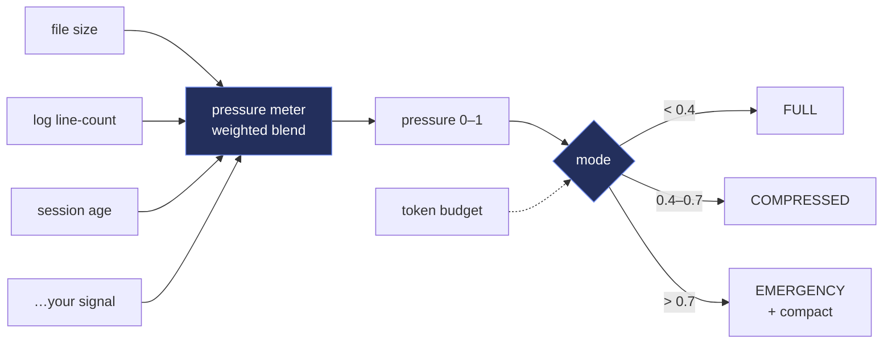

# Context Budget — Architecture

Context Budget keeps a long-running LLM agent from capsizing under its own context. Register the signals that predict pressure — memory-file size, log line-counts, session age, task count, anything — each with comfortable/stressed/critical thresholds and a weight. Context Budget blends them into a single 0–1 pressure score and picks a load mode: FULL, COMPRESSED, or EMERGENCY. Pair it with a token budget (a cheap chars-based estimate or your own tokenizer) to decide how much history to keep, when to summarize, and when to hard-trim. Pure Node, zero dependencies, never throws — a small keel for agents that run for hours.

## Flow

## How it fits together

Context Budget is a pure library — no disk, no network. `normalize(value, {comfortable, stressed, critical})` maps a raw signal onto 0–1 with two linear segments (0→0.5 across comfortable→stressed, 0.5→1 across stressed→critical, clamped). A `Meter` holds registered signals `{ name, weight, value, comfortable, stressed, critical }` where `value` is a number or a lazy function (a throw contributes 0, never crashes the reading); `pressure()` returns the weight-normalized blend of every signal's normalized value, `report()` returns the per-signal breakdown, and `mode()` maps the pressure onto FULL / COMPRESSED / EMERGENCY using configurable cutoffs (default 0.4 / 0.7). `estimateTokens(text)` is a fast chars/4 heuristic you can replace with a real tokenizer; a `Budget(total)` tracks `spend()` / `remaining()` / `over()` against a ceiling and exposes `fraction()` for feeding back into a signal. Nothing here is bound to a particular app — you register the signals and thresholds that predict pressure in your agent, and Context Budget turns them into a mode decision and a token ledger.

## Extending it

Every capability is a self-contained module. To add your own, follow the contract the existing
modules use and wire it into the entry point. Keep it portable — config via `.env`, no hardcoded
paths, no personal accounts.

## Design principles

1. **Make pressure observable.** One 0–1 score from weighted signals beats discovering the ceiling by hitting it.
2. **Degrade on purpose.** Modes let you shed load in steps while you still have room to choose what to keep.
3. **Bring your own signals + tokenizer.** Everything is injected — file sizes, counts, ages, a real token counter — nothing is hardwired to one app.
4. **Pure + fail-open.** No disk, no network, no throws — a signal that errors contributes 0, and the meter keeps reading.
